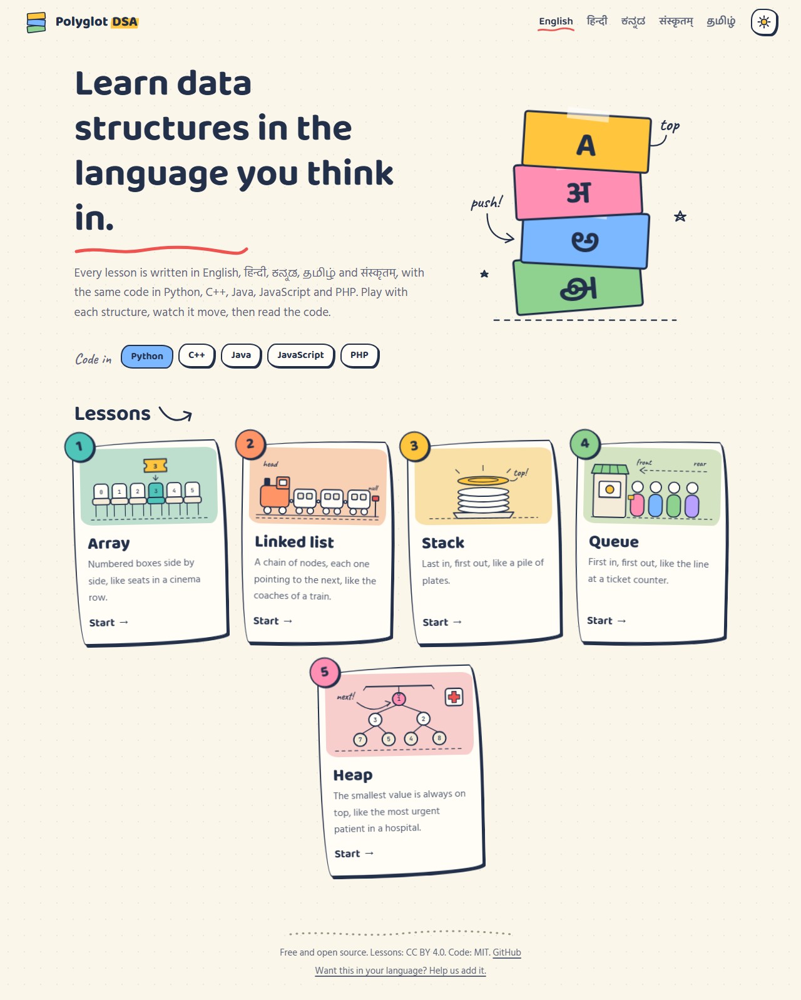
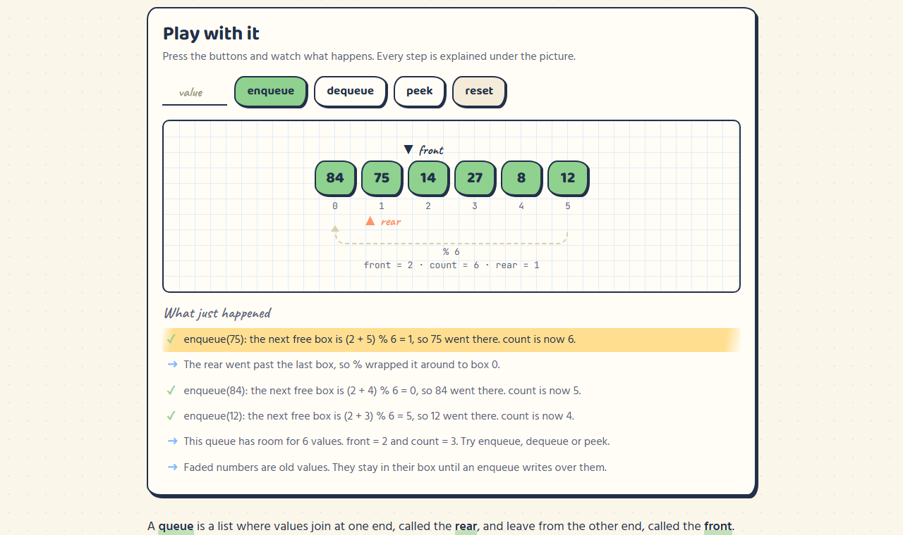

# ◆ Polyglot DSA

**Data structures, in your language.**
Data structures, अपनी भाषा में। · Data structures, ನಿಮ್ಮ ಭಾಷೆಯಲ್ಲಿ. · Data structures, உங்கள் மொழியில். · Data structures, स्वभाषायाम्।

Most people first understand an idea in the language they think in. Polyglot DSA teaches
data structures in **English, हिन्दी, ಕನ್ನಡ, தமிழ் and संस्कृतम्**, with the same working program in
**Python, C++, Java, JavaScript and PHP**. Every lesson has a playground where you press
buttons and watch the structure move, step by step, with each step explained in your
language.

**Website:** https://mark-alexander-hub.github.io/polyglot-dsa/





## Lessons

| # | Structure | English | हिन्दी | ಕನ್ನಡ | தமிழ் | संस्कृतम् | Code |
|---|---|---|---|---|---|---|---|
| 1 | Array | [en](structures/array/lesson/en.md) | [hi](structures/array/lesson/hi.md) | [kn](structures/array/lesson/kn.md) | [ta](structures/array/lesson/ta.md) | [sa](structures/array/lesson/sa.md) | [code](structures/array/code) |
| 2 | Linked list | [en](structures/linked-list/lesson/en.md) | [hi](structures/linked-list/lesson/hi.md) | [kn](structures/linked-list/lesson/kn.md) | [ta](structures/linked-list/lesson/ta.md) | [sa](structures/linked-list/lesson/sa.md) | [code](structures/linked-list/code) |
| 3 | Stack | [en](structures/stack/lesson/en.md) | [hi](structures/stack/lesson/hi.md) | [kn](structures/stack/lesson/kn.md) | [ta](structures/stack/lesson/ta.md) | [sa](structures/stack/lesson/sa.md) | [code](structures/stack/code) |
| 4 | Queue | [en](structures/queue/lesson/en.md) | [hi](structures/queue/lesson/hi.md) | [kn](structures/queue/lesson/kn.md) | [ta](structures/queue/lesson/ta.md) | [sa](structures/queue/lesson/sa.md) | [code](structures/queue/code) |
| 5 | Heap | [en](structures/heap/lesson/en.md) | [hi](structures/heap/lesson/hi.md) | [kn](structures/heap/lesson/kn.md) | [ta](structures/heap/lesson/ta.md) | [sa](structures/heap/lesson/sa.md) | [code](structures/heap/code) |

> **The Hindi, Kannada, Tamil and Sanskrit lessons are drafts.** They follow our
> [translation guide](docs/translation-guide.md) but have not yet been checked by native
> speakers. If one of these is your language, a review is the most valuable thing you can
> give this project: [review a translation](../../issues/new?template=review-translation.yml).

## How it is built

Writing every lesson for every pair of human and programming language would mean
5 × 5 = 25 versions of each lesson, and they would drift apart. Instead:

- **One explanation per human language.** `structures/<name>/lesson/<language>.md`
- **One program per programming language.** `structures/<name>/code/<language>/`
- The website puts them side by side. A line like `<!-- code: push -->` in a lesson shows
  the `push` part of whichever programming language the reader picked. The code marks those
  parts with `@snippet push` … `@end` comments.
- **All five programs must print exactly the same output**, stored in
  `expected-output.txt`. Every pull request runs them all, so the five languages can never
  quietly disagree.
- **Translations know when they are out of date.** Each one records a fingerprint of the
  English lesson it came from. If the English changes later, the website tells readers and
  `npm run translations` lists it.

```
structures/stack/
  meta.json               order, card shape and colour
  lesson/en.md hi.md …    the explanation, one file per language
  labels/en.json …        title, summary and playground text
  code/python/stack.py    the same program in five languages
  code/cpp/stack.cpp
  code/java/Stack.java
  code/javascript/stack.js
  code/php/stack.php
  illustration.svg        the hand-drawn scene on the lesson card (optional)
  expected-output.txt     what every program must print
  visualizer.js           the playground
site/                     page styles, scripts and interface text (site/i18n)
scripts/                  build, translation status and code tests
docs/translation-guide.md
```

## Run it on your computer

You need [Node.js](https://nodejs.org) 20 or newer.

```sh
npm install
npm run dev          # builds the site and serves it at http://localhost:4173
npm test             # runs every program you have a compiler for
npm run translations # shows which translations are draft, reviewed or out of date
```

To run the tests for all five languages you also need Python 3, a C++17 compiler (`g++`,
or set `CXX`), Java 17 or newer and PHP 8.1 or newer (or set `PHP`).

## Help us

- **Speak Hindi, Kannada, Tamil or Sanskrit?** Review a lesson. Even one corrected sentence helps.
- **Want your language?** Marathi, Telugu, Bengali, Malayalam, Gujarati, Punjabi, Odia,
  Urdu: see [adding a language](CONTRIBUTING.md#add-a-language). Lessons you have not
  translated yet show the English version until you do.
- **Found a bug in a program or a lesson?** [Open an issue](../../issues/new/choose).
- **Want to teach another structure?** See [adding a structure](CONTRIBUTING.md#add-a-structure).

Read [CONTRIBUTING.md](CONTRIBUTING.md) before your first pull request.

## Licence

Code (programs, scripts, website) is [MIT](LICENSE). Lessons and translations are
[CC BY 4.0](https://creativecommons.org/licenses/by/4.0/): share and adapt them, including in
your classroom, with credit to Polyglot DSA.
